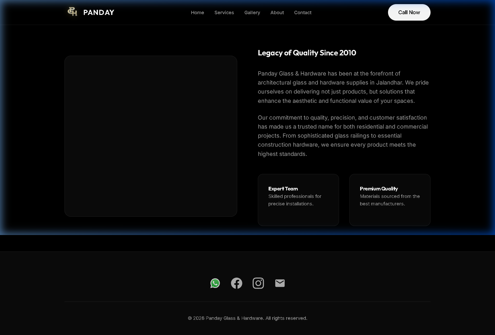
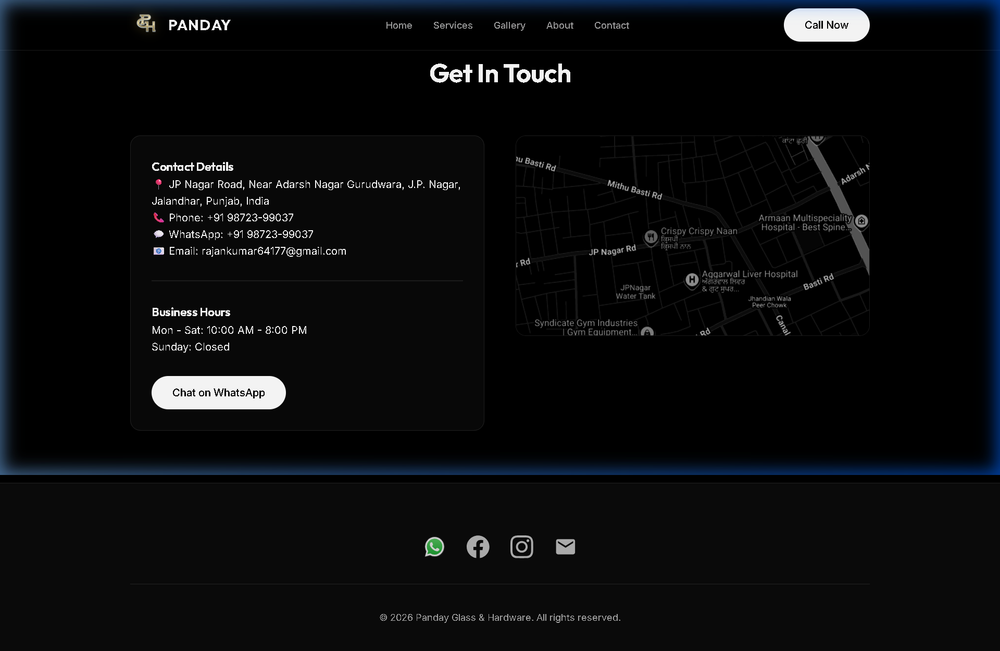

# 💎 Panday Glass & Hardware

**Exclusive Designer Glass Gallery & Luxury Hardware Solutions**

Welcome to the official repository for **Panday Glass & Hardware (PGH)**, a premium architectural glass and hardware showroom located in Jalandhar, Punjab. This project showcases a high-end, responsive web experience designed to highlight master craftsmanship in luxury glasswork.

---

## 📸 Visual Preview

### 🏠 Home Page - Premium Branding


### 🛠️ Our Expertise - Master Craftsmanship


### 🖼️ Portfolio - Bespoke Installations


### 📞 Contact - Get In Touch


---

## ✨ Key Features

- **💎 Premium Glassmorphism UI**: A sleek, modern design language using backdrop blurs and subtle borders.
- **📱 Fully Responsive**: Optimized for seamless viewing on Desktops, Tablets, and Mobile devices.
- **✨ Smooth Animations**: Integrated scroll-reveal effects and floating animations for an interactive feel.
- **🚀 Performance Optimized**: Built with Vite for lightning-fast load times.
- **💬 Direct Integration**: One-click WhatsApp and Call buttons for instant business inquiries.
- **📍 Interactive Maps**: Embedded Google Maps for easy showroom navigation.

---

## 🛠️ Tech Stack

- **Frontend**: HTML5, Vanilla JavaScript
- **Styling**: [Tailwind CSS](https://tailwindcss.com/) (Custom Config)
- **Build Tool**: [Vite](https://vitejs.dev/)
- **Fonts**: Playfair Display (Serif) & Manrope (Sans-serif) via Google Fonts
- **Icons**: Material Icons & FontAwesome

---

## 🚀 Getting Started

To run this project locally, follow these steps:

### 1. Clone the repository
```bash
git clone https://github.com/jaygupta-exe/pandayglass.git
cd pandayglass
```

### 2. Install dependencies
```bash
npm install
```

### 3. Start development server
```bash
npm run dev
```

### 4. Build for production
```bash
npm run build
```

---

## 📍 Showroom Location

**Panday Glass & Hardware**  
JP Nagar Road, Near Adarsh Nagar Gurudwara,  
Jalandhar, Punjab, India  

---

## 📞 Contact Information

- **Phone**: +91 98723-99037
- **Email**: rajankumar64177@gmail.com
- **Instagram**: [@panday_glass_hardware__](https://www.instagram.com/panday_glass_hardware__/)
- **Facebook**: [Panday Glass](https://www.facebook.com/349000038306481)

---

*Designed & Developed with ❤️ to showcase luxury craftsmanship.*
